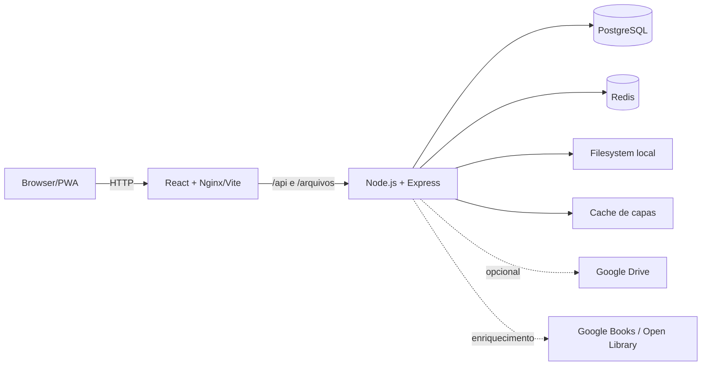

# Documentação do Araru

Fonte de verdade técnica e arquitetural do projeto. O código é a autoridade final; estes documentos descrevem o estado verificado em agosto de 2026 e separam explicitamente implementação atual de direções futuras.

Identidade e uso da marca: [Araru](brand/README.md).

## Começar

- [Visão geral](getting-started/overview.md)
- [Desenvolvimento local](getting-started/development.md)
- [Variáveis de ambiente](getting-started/environment.md)
- [Estrutura do projeto](getting-started/project-structure.md)

## Arquitetura atual

- [Sistema e boundaries](architecture/overview.md)
- [Fluxos de dados](architecture/data-flow.md)
- [Storage](architecture/storage-architecture.md)
- [Readers](architecture/reader-architecture.md)
- [Jobs e caches](architecture/jobs-and-cache.md)
- [Administração, usuários e perfis](architecture/admin-panel.md)
- [Decisões arquiteturais](architecture/decisions.md)

## Implementação

- [Frontend](frontend/overview.md): [rotas e estado](frontend/routing-and-state.md), [biblioteca](frontend/library-ui.md), [reader e PWA](frontend/reader-and-pwa.md)
- [Backend](backend/overview.md): [configuração](backend/configuration.md), [PostgreSQL e Redis](backend/postgresql-and-redis.md), [catálogo e metadados](backend/catalog-and-metadata.md), [operação e segurança](backend/operations-and-security.md)
- [API](api/overview.md): [inventário de endpoints](api/endpoints.md)
- [Readers](readers/overview.md): [formatos](readers/formats.md), [performance e progresso](readers/performance-and-progress.md)
- [Infraestrutura](infrastructure/docker-and-production.md)

## Qualidade e operação

- [Estratégia de testes](testing/overview.md)
- [Matriz de cobertura](testing/test-matrix.md)
- [Runbook](operations/runbook.md)
- [Troubleshooting](operations/troubleshooting.md)
- [Convenções](development/conventions.md)
- [Guias de mudança](development/change-guides.md)
- [Definition of Done](development/definition-of-done.md)

## Evolução

- [ADRs](adr/README.md)
- [Limitações atuais](roadmap/current-limitations.md)
- [Evolução do backend](roadmap/backend-evolution.md)
- [Escalabilidade](roadmap/scalability.md)
- [Clientes futuros](roadmap/clients.md)

## Contexto para agentes

Agentes de código devem começar em [docs/llm/README.md](llm/README.md). Esse conjunto resume arquitetura, domínio, invariantes, testes e protocolo de alteração sem misturar roadmap com implementação.

## Arquitetura resumida



Estado atual: repositórios independentes para Web React, Server Express/PostgreSQL, Redis para cache e documentação. O Compose oficial publica a interface em `8080` e a API em `3001` por padrão.

```bash
npm install
npm run dev
# ou
docker compose up -d --build --wait
```
