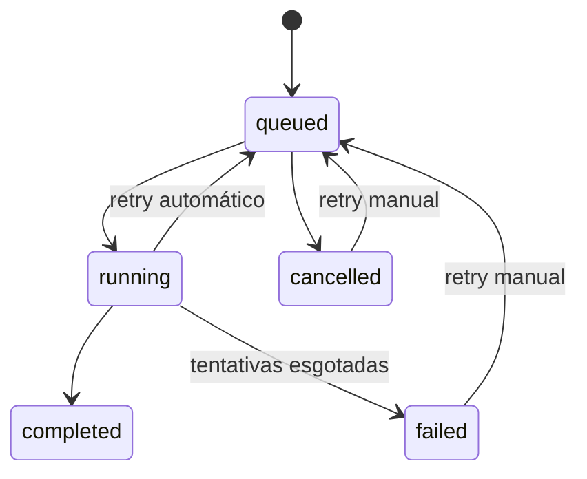

# Jobs e caches

## Jobs

A fila é local ao processo, com histórico em `background_jobs`. Ela ordena prioridade/data, deduplica por chave, limita concorrência, persiste tentativas e recupera registros `running` como `queued` após reinício.

Job em execução não é cancelável pelo mecanismo atual; apenas pendentes podem ser cancelados.

## Caches

| Cache | Local | Política/limite | Invalidação |
|---|---|---|---|
| catálogo/capas em memória | backend `Map` | `CACHE_TTL` | refresh, login/logout, restore |
| metadata API | Redis | 60 dias positivo/3 negativo por padrão | TTL, refresh e manutenção |
| capas derivadas | disco + `cache_entries` | `CACHE_MAX_GB`, LRU | fingerprint, versão, cleanup |
| índices de comics | memória do reader service | fingerprint | mudança/reinício |
| TanStack Query | navegador | stale 60s, gc 15min | mutations/refetch |
| PWA shell/catalog/capas/assets | Cache Storage | versões e até 100/200/80 entradas | versão do SW |
| offline books | Cache Storage + IndexedDB | explícito/quota do navegador | remoção do usuário |
| páginas PDF/comic | memória do reader | atual e vizinhas | navegação/cleanup |

Nenhum cache substitui PostgreSQL ou arquivo fonte.
