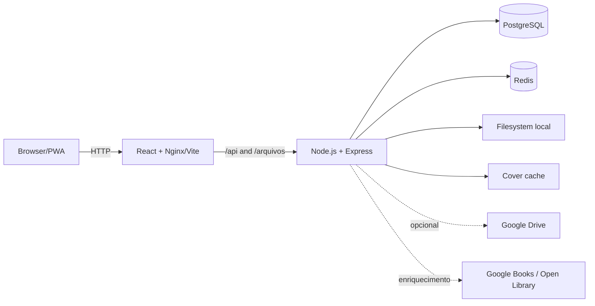

The project's technical and architectural source of truth. Code is the final authority; these documents describe the state verified in August 2026 and explicitly separate current implementation from future directions.

Brand identity and usage: [Araru](../brand/readme/).

## Getting started

- [Overview](../getting-started/overview/)
- [Local development](../getting-started/development/)
- [Environment variables](../getting-started/environment/)
- [Project structure](../getting-started/project-structure/)

## Current architecture

- [System boundaries](../architecture/overview/)
- [Data flows](../architecture/data-flow/)
- [Storage](../architecture/storage-architecture/)
- [Readers](../architecture/reader-architecture/)
- [Jobs and caches](../architecture/jobs-and-cache/)
- [Administration, users, and profiles](../architecture/admin-panel/)
- [Architectural decisions](../architecture/decisions/)

## Implementation

- [Frontend](../frontend/overview/): [routing and state](../frontend/routing-and-state/), [library](../frontend/library-ui/), [reader and PWA](../frontend/reader-and-pwa/)
- [Backend](../backend/overview/): [configuration](../backend/configuration/), [PostgreSQL and Redis](../backend/postgresql-and-redis/), [catalog and metadata](../backend/catalog-and-metadata/), [operations and security](../backend/operations-and-security/)
- [API](../api/overview/): [endpoint inventory](../api/endpoints/)
- [Readers](../readers/overview/): [formats](../readers/formats/), [performance and progress](../readers/performance-and-progress/)
- [Infrastructure](../infrastructure/docker-and-production/)

## Quality and operations

- [Testing strategy](../testing/overview/)
- [Coverage matrix](../testing/test-matrix/)
- [Runbook](../operations/runbook/)
- [Troubleshooting](../operations/troubleshooting/)
- [Conventions](../development/conventions/)
- [Change guides](../development/change-guides/)
- [Definition of Done](../development/definition-of-done/)

## Evolution

- [ADRs](../adr/readme/)
- [Current limitations](../roadmap/current-limitations/)
- [Backend evolution](../roadmap/backend-evolution/)
- [Scalability](../roadmap/scalability/)
- [Future clients](../roadmap/clients/)

## Context for agents

Code agents should start at [docs/llm/README.md](../llm/readme/). This set summarizes architecture, domain, invariants, tests, and the change protocol without mixing the roadmap with implementation.

## Architecture at a glance



Current state: independent repositories for the React Web client, Express/PostgreSQL Server, Redis cache, and documentation. The official Compose setup publishes the interface on `8080` and the API on `3001` by default.

```bash
npm install
npm run dev
# or
docker compose up -d --build --wait
```
