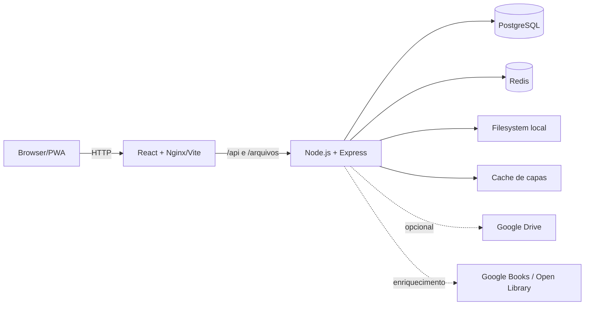

Fonte de verdade técnica e arquitetural do projeto. O código é a autoridade final; estes documentos descrevem o estado verificado em agosto de 2026 e separam explicitamente implementação atual de direções futuras.

Identidade e uso da marca: [Araru](../brand/readme/).

## Começar

- [Visão geral](../getting-started/overview/)
- [Desenvolvimento local](../getting-started/development/)
- [Variáveis de ambiente](../getting-started/environment/)
- [Estrutura do projeto](../getting-started/project-structure/)

## Arquitetura atual

- [Sistema e boundaries](../architecture/overview/)
- [Fluxos de dados](../architecture/data-flow/)
- [Storage](../architecture/storage-architecture/)
- [Readers](../architecture/reader-architecture/)
- [Jobs e caches](../architecture/jobs-and-cache/)
- [Administração, usuários e perfis](../architecture/admin-panel/)
- [Decisões arquiteturais](../architecture/decisions/)

## Implementação

- [Frontend](../frontend/overview/): [rotas e estado](../frontend/routing-and-state/), [biblioteca](../frontend/library-ui/), [reader e PWA](../frontend/reader-and-pwa/)
- [Backend](../backend/overview/): [configuração](../backend/configuration/), [PostgreSQL e Redis](../backend/postgresql-and-redis/), [catálogo e metadados](../backend/catalog-and-metadata/), [operação e segurança](../backend/operations-and-security/)
- [API](../api/overview/): [inventário de endpoints](../api/endpoints/)
- [Readers](../readers/overview/): [formatos](../readers/formats/), [performance e progresso](../readers/performance-and-progress/)
- [Infraestrutura](../infrastructure/docker-and-production/)

## Qualidade e operação

- [Estratégia de testes](../testing/overview/)
- [Matriz de cobertura](../testing/test-matrix/)
- [Runbook](../operations/runbook/)
- [Troubleshooting](../operations/troubleshooting/)
- [Convenções](../development/conventions/)
- [Guias de mudança](../development/change-guides/)
- [Definition of Done](../development/definition-of-done/)

## Evolução

- [ADRs](../adr/readme/)
- [Limitações atuais](../roadmap/current-limitations/)
- [Evolução do backend](../roadmap/backend-evolution/)
- [Escalabilidade](../roadmap/scalability/)
- [Clientes futuros](../roadmap/clients/)

## Contexto para agentes

Agentes de código devem começar em [docs/llm/README.md](../llm/readme/). Esse conjunto resume arquitetura, domínio, invariantes, testes e protocolo de alteração sem misturar roadmap com implementação.

## Arquitetura resumida



Estado atual: repositórios independentes para Web React, Server Express/PostgreSQL, Redis para cache e documentação. O Compose oficial publica a interface em `8080` e a API em `3001` por padrão.

```bash
npm install
npm run dev
# ou
docker compose up -d --build --wait
```
