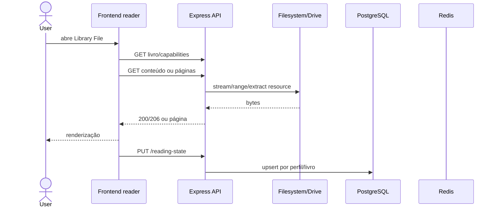

## Catálogo

Filesystem/Drive → descoberta → fingerprint/ID → `library_files` → FTS → API → TanStack Query → biblioteca virtualizada.

## Leitura

PDF usa Range no conteúdo original. EPUB é obtido como conteúdo e interpretado pelo parser frontend. MOBI e comics podem usar páginas/recursos derivados pelo backend. O progresso é mesclado localmente e remotamente pela posição mais recente.

## Metadados

Filename e conteúdo interno → normalização/ISBN → candidatos externos → score/confiança → campos sugeridos ou aplicados → PostgreSQL → revisão manual. Respostas externas são armazenadas temporariamente no Redis; campos manuais não são sobrescritos.
