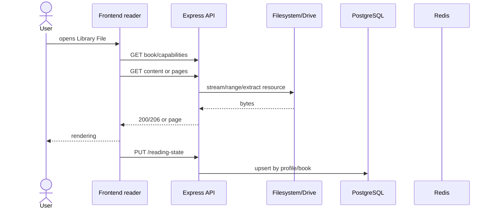

## Catalog

Filesystem/Drive → descoberta → fingerprint/ID → `library_files` → FTS → API → TanStack Query → biblioteca virtualizada.

## Reading

PDF uses Range on the original content. EPUB is fetched as content and interpreted by the frontend parser. MOBI and comics may use pages/resources derived by the backend. Progress is merged locally and remotely using the most recent position.

## Metadata

Filename and internal content → normalization/ISBN → external candidates → score/confidence → suggested or applied fields → PostgreSQL → manual review. External responses are stored temporarily in Redis; manual fields are not overwritten.
