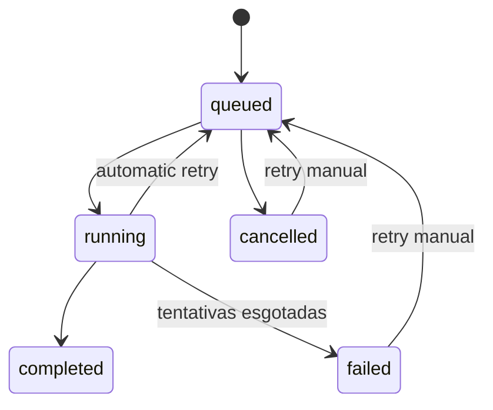

## Jobs

The queue maintains history and claims in `background_jobs`. Each worker acquires jobs by claiming them conditionally on status/lease, registers `worker_id`, `lease_until` and `heartbeat_at`, orders by priority/date, deduplicates by key, and persists attempts. Scheduling and some caches remain local to the process.

Jobs in execution depend on timeout/lease; cooperative cancellation of external processes should still be handled by the specific handler.

## Caches

| Cache | Local | Policy/Limit | Invalidation |
|---|---|---|---|
| catalog/covers in memory | backend `Map` | `CACHE_TTL` | refresh, login/logout, restore |
| metadata API | Redis | 60 days positive/3 negative by default | TTL, refresh and maintenance |
| derived covers | disk + `cache_entries` | `CACHE_MAX_GB`, LRU | fingerprint, version, cleanup |
| comic indices | reader service memory | fingerprint | change/restart |
| TanStack Query | browser | stale 60s, gc 15min | mutations/refetch |
| PWA shell/catalog/covers/assets | Cache Storage | versions and up to 100/200/80 entries | SW version |
| offline books | Cache Storage + IndexedDB | explicit/quota of the browser | user removal |
| PDF/comic pages | reader memory | current and neighbors | navigation/cleanup |

No cache replaces PostgreSQL or source files.
