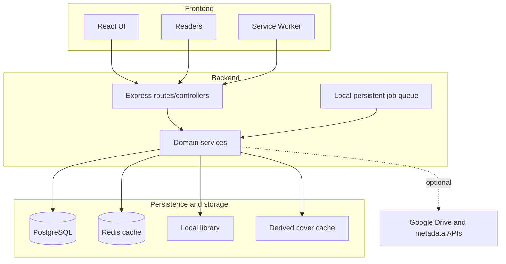

## Boundaries

O frontend apresenta e mantém estado efêmero. O backend detém regras, paths, credenciais, indexação e persistência. A comunicação é HTTP/JSON, exceto streams/binários de conteúdo, páginas, capas e backups.

O frontend não deve acessar filesystem, bancos, paths físicos ou conter secrets. O backend não deve depender do build da SPA. Em desenvolvimento existe proxy Vite; no Compose o Nginx do frontend cria uma origem única.

## Processos atuais

- um processo Node executa API, watcher, fila e manutenção;
- um processo Nginx entrega o frontend e faz proxy;
- PostgreSQL é a fonte de verdade do estado persistente;
- Redis mantém caches compartilhados e nunca substitui o PostgreSQL;
- caches são auxiliares e regeneráveis.

Consulte [limitações](../../roadmap/current-limitations/) antes de propor escala horizontal ou multiusuário.
