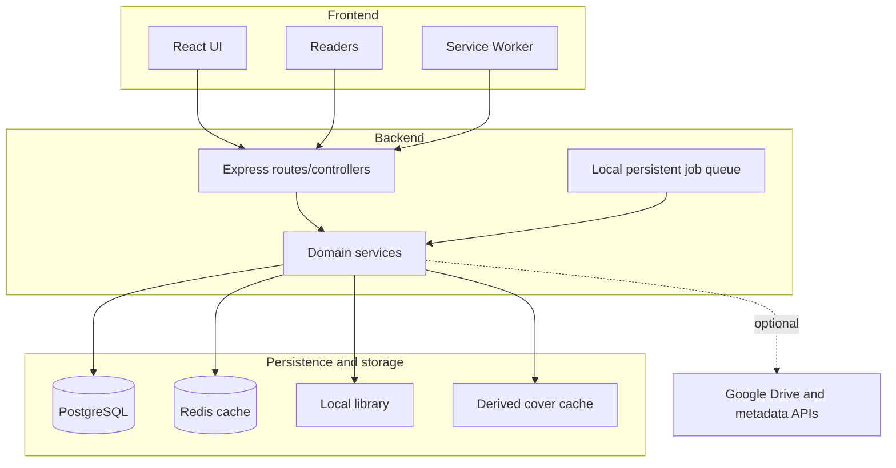

## Boundaries

The frontend presents and maintains ephemeral state. The backend holds rules, paths, credentials, indexing, and persistence. Communication is HTTP/JSON, except for content streams/binaries, pages, covers, and backups.

The frontend should not access the filesystem, databases, physical paths, or contain secrets. The backend should not depend on the build of the SPA. In development, there is a Vite proxy; in Compose, the frontend Nginx creates a single origin.

## Current Processes

- A Node process runs the API, watcher, queue, and maintenance;
- An Nginx process delivers the frontend and acts as a proxy;
- PostgreSQL is the source of truth for persistent state;
- Redis maintains shared caches and never substitutes PostgreSQL;
- Caches are auxiliary and regenerable.

Refer to [limitations](../../roadmap/current-limitations/) before proposing horizontal scaling or multi-user support.
