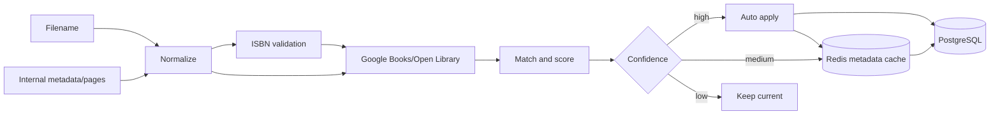

## Catálogo

`driveService` descobre fontes; `libraryIndexService` persiste arquivos e FTS. IDs/URLs existentes são preservados. Fingerprint detecta mudança; watcher reconcilia localmente; jobs periódicos fazem manutenção. Ausência tem retenção antes de limpeza definitiva.

`Work` é canônico; `LibraryFile` é físico. `work_files` permite formatos/duplicatas sem mudar IDs antigos.

Categorias são exclusivamente o path da pasta. Overrides manuais não criam árvore paralela.

## Pipeline de metadados

Providers usam cache positivo/negativo, timeout, retry e circuit breaker. Matching considera ISBN, título/subtítulo e autores. Campos manuais são protegidos. Thresholds são configuráveis.

## Capas

Prioridade depende do formato e dados disponíveis: capa interna/primeira imagem, provider, primeira página. O derivado registra origem, dimensões, proporção, qualidade, fingerprint e versão. Mudança de arquivo/pipeline invalida; operação lista/regenera problemas.
