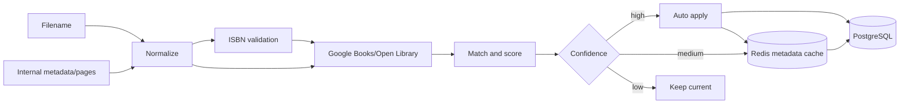

PRODUCTS

`driveService` discovers sources; `libraryIndexService` persists files and FTS. Existing IDs/URLs are preserved. Fingerprint detects change; watcher reconciles locally; periodic jobs perform maintenance. Absence has retention before definitive cleaning.

`Work` is canonical; `LibraryFile` is physical. `work_files` allows formats/duplicates without changing old IDs.

Categories are exclusively the path of the folder. Manual overrides do not create parallel tree.

## Metadata pipeline

Providers use positive/negative cache, timeout, retry, and circuit breaker. Matching considers ISBN, title/subtitle and authors. Manual fields are protected. Thresholds are configurable.

## Covers

Priority depends on the format and data available: inner cover/first image, provider, first page. The derivative records origin, dimensions, proportion, quality, fingerprint and version. File/pipeline change invalid; list/regenerate operation issues.
