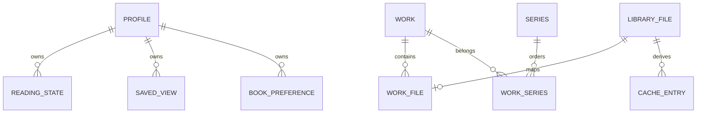

- LibraryFile: ID, source/sourceId, relativePath, fingerprint, status, categoryPath, metadata/capa.
- Work: obra canônica identificada por ISBN/título normalizado; não substitui arquivo.
- WorkFile: associação com primary/format.
- Series/WorkSeries: agrupamento e sequência/volume.
- Profile: perfil local selecionável; não é account.
- ReadingState: favoritos, histórico, progresso e estatísticas por perfil/livro.
- SavedView/BookPreference: personalização por perfil.
- BackgroundJob: payload, dedupe, prioridade, status, tentativas e timestamps.
- CacheEntry: derivado em disco, tamanho, fingerprint, versão e LRU.
- DuplicateDecision: decisão persistida sobre candidato.
- Metadata Candidate: estrutura de runtime/persistência de campos com origem/confiança, não tabela canônica isolada.
- BackupHistory/IntegrityReport/ReaderMetric/FeatureFlag: suporte operacional/produto.

Consulte [PostgreSQL e Redis](../backend/postgresql-and-redis.md) para tabelas reais.
