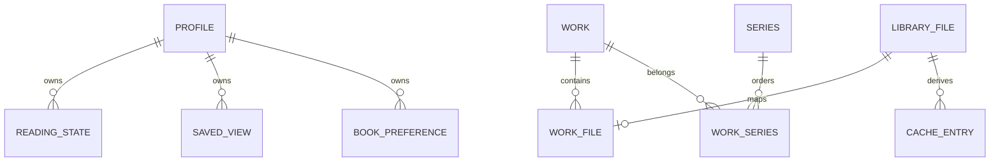

- LibraryFile: ID, source/sourceId, relativePath, fingerprint, status, categoryPath, metadata/capa.
- Work: canonical work identified by ISBN/title normalized; does not replace file.
- WorkFile: association with primary/format.
- Series/WorkSeries: grouping and sequence/volume.
- Profile: selectable local profile; not an account.
- ReadingState: favorites, history, progress, and statistics per profile/book.
- SavedView/BookPreference: personalization per profile.
- BackgroundJob: payload, dedupe, priority, status, attempts, and timestamps.
- CacheEntry: derived on disk, size, fingerprint, version, and LRU.
- DuplicateDecision: persisted decision about candidate.
- Metadata Candidate: runtime/persistence structure of fields with origin/confidence, not isolated canonical table.
- BackupHistory/IntegrityReport/ReaderMetric/FeatureFlag: operational/product support.

Refer to [PostgreSQL and Redis](../../backend/postgresql-and-redis/) for real tables.
