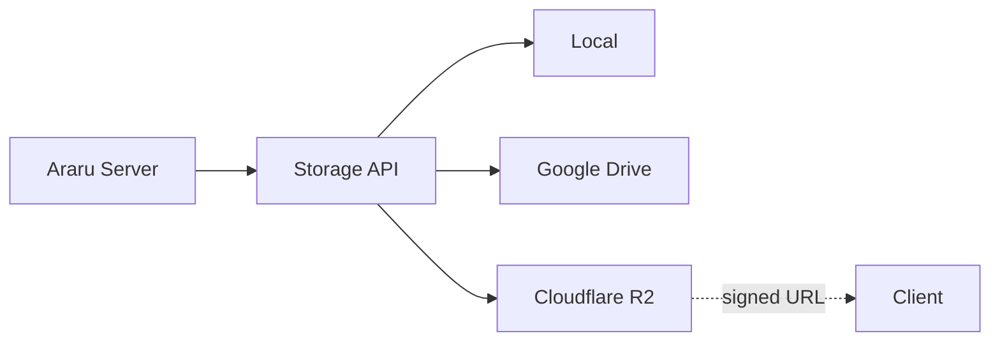

## Abstração

O Server usa providers de storage. O domínio persiste `storage_provider`, `storage_key`, identidade do provider, tamanho, MIME, ETag/checksum e fingerprint em `library_files`. PostgreSQL continua sendo a fonte de verdade; Redis contém apenas dados efêmeros.

## Filesystem local

`LOCAL_LIBRARY_DIR` é percorrido para descobrir formatos suportados. O ID local codifica o caminho relativo; fingerprint e timestamps detectam alterações. `categoryPath` é o diretório relativo sem o filename. Streams e Range evitam ler PDFs grandes integralmente.

## Google Drive

É uma fonte opcional. A configuração aceita pasta única ou `drive-folders.json`, API key e OAuth. Credenciais OAuth são criptografadas no PostgreSQL; `source_sync_state` guarda cursor incremental. Falhas não devem apagar itens apenas por ausência transitória; o catálogo usa status/retenção.

## Derivados

`COVER_CACHE_DIR` guarda capas regeneráveis. `cache_entries` registra path, tamanho, fingerprint, versão e último acesso. Integridade e LRU removem órfãos/excesso. Cache nunca é fonte de verdade.

## Cloudflare R2

R2 usa a API compatível com S3 através do AWS SDK v3. O bucket deve permanecer privado. O provider suporta listagem, `HeadObject`, streaming, Range, upload, remoção, URLs assinadas de leitura/upload e multipart.

Google Drive também possui provider próprio para leitura, `stat`, listagem paginada e Range. OAuth continua sendo usado para conteúdo privado e API Key para conteúdo público; falhas transitórias passam pelo circuit breaker existente.

Configure `STORAGE_PROVIDER=r2`, `R2_ENDPOINT`, `R2_ACCESS_KEY_ID`, `R2_SECRET_ACCESS_KEY`, `R2_BUCKET`, `R2_REGION`, `R2_PREFIX` e `R2_SIGNED_URL_TTL`. Secrets permanecem no Server e nunca são retornados ao Web.

O fluxo de arquivos grandes é `POST /api/v1/admin/storage/r2/upload-url` → upload direto para a URL temporária → `POST /api/v1/admin/storage/r2/complete`. Esses endpoints são administrativos e não tornam o bucket público.

Arquivos originais não são sobrescritos por derivados. URLs assinadas são temporárias e não são persistidas.

## Direção futura

Migração automática entre providers e seleção de múltiplas libraries ainda não estão implementadas. CDN/custom domain é opcional e não é requisito do runtime.
